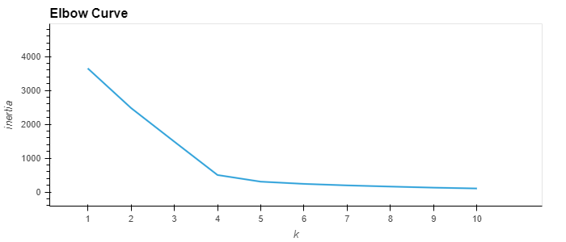
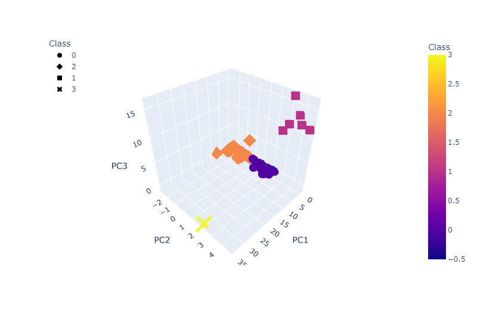
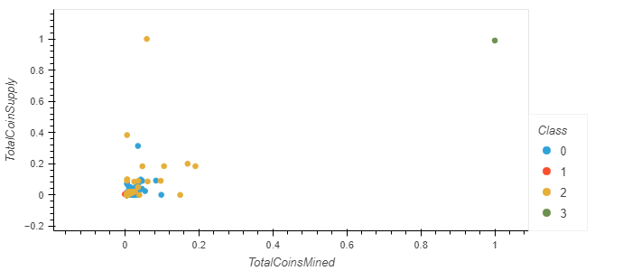

# Cryptocurrencies

## Overview

### Purpose
Create an analysis for your clients who are preparing to get into the cryptocurrency market using PCA, classification, and unsupervised learning.

### Background
Martha is a senior manager for the Advisory Services Team at Accountability Accounting, one of your most important clients. Accountability Accounting, a prominent investment bank, is interested in offering a new cryptocurrency investment portfolio for its customers. The company, however, is lost in the vast universe of cryptocurrencies. So, they’ve asked you to create a report that includes what cryptocurrencies are on the trading market and how they could be grouped to create a classification system for this new investment.

The data Martha will be working with is not ideal, so it will need to be processed to fit the machine learning models. Since there is no known output for what Martha is looking for, she has decided to use unsupervised learning. To group the cryptocurrencies, Martha decided on a clustering algorithm. She’ll use data visualizations to share her findings with the board.

## Results

This elbow curve was used to find how many clusters to use. Since the elbow of the curve is at k = 4 we will be using 4 clusters.

### 3D Scatterplot

This 3D scatterplot was used to graph the clusters and have a visual of their position relative to PC1, PC2, and PC3.

### Total coins mined vs supply Scatterplot

This scatterplot plots the total coin supply and total coins mined of different coins. The hue of the dots represents the coin class.

